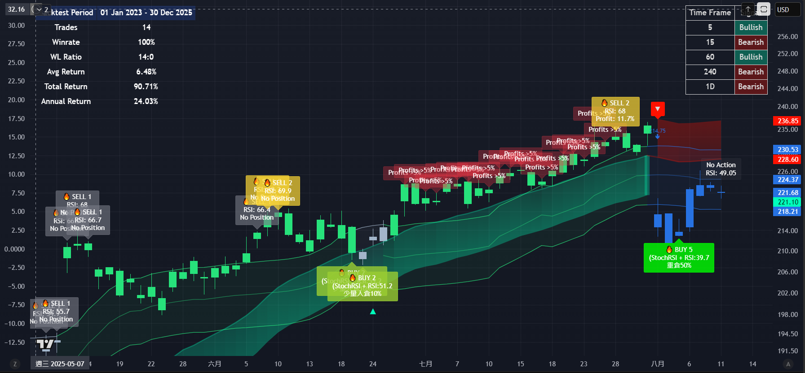

# 📊 FRAMA Channel + Stoch RSI — Intraday Signal (Showcase)

> **Intraday trend-following + mean-reversion hybrid strategy** combining **FRAMA channel**, **Stochastic RSI + RSI scoring**, **Zero-Lag EMA band**, and **multi-timeframe (MTF) trend table**.  

> This repository **only contains visual examples and methodology overview** — the **source code is private**.

---

## 📌 Key Features

- **Adaptive FRAMA Channel**  
  Automatically adjusts to volatility, with dynamic upper/lower bands and momentum-based colouring.

- **Multi-Layer Oscillator Filtering**  
  Uses Stochastic RSI + RSI to classify oversold entries into **5 BUY scores** and overbought exits into **5 SELL scores**.

- **Zero-Lag EMA Trend Bands**  
  Fast trend flip detection with upper/lower deviation bands; generates ▲/▼ markers for regime change.

- **Multi-Timeframe Trend Consensus Table**  
  Aggregates signals from **5m, 15m, 60m, 4h, 1D** for higher confidence entries.

- **Position Sizing Suggestions** *(illustrative only)*  
  BUY score drives light/core/heavy allocation hints.

---

## 🖼 Screenshots

**1) FRAMA + Stoch RSI + ZLEMA bands + MTF table + Stats (Showcase)**  

*(All labels, colours, and figures are illustrative; thresholds and parameters are intentionally abstracted to protect proprietary logic.)*

---

## 📈 High-Level Logic (Abstracted)

1. **Trend Context**  
   - Zero-Lag EMA deviation bands define bullish/bearish regime.  
   - FRAMA channel confirms momentum direction.

2. **Entry (BUY)**  
   - Stoch RSI + RSI identify oversold pullbacks within trend.  
   - Deeper dislocations → higher BUY score (1–5).

3. **Exit (SELL)**  
   - Overbought signals combined with profit thresholds.  
   - Higher SELL score → stronger take-profit bias.

4. **MTF Confirmation**  
   - Align lower timeframe entries with higher timeframe trend consensus.

---

## 📜 License

**All rights reserved.**  
- No commercial use without explicit permission  
- No redistribution of code or derivatives  
- You may view and share the screenshots for non-commercial purposes with attribution

---

