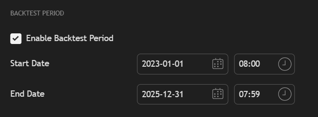

# FRAMA Channel + Stoch RSI — Intraday Signal (Showcase)

Intraday trend-following & mean-reversion hybrid trading strategy, integrating an adaptive FRAMA channel for dynamic support/resistance, multi-layer Stochastic RSI + RSI scoring for precision entries/exits, a Zero-Lag EMA band for rapid trend detection, and a multi-timeframe (MTF) trend table to align signals across time horizons. Designed for high-confidence intraday decision-making while balancing momentum capture with disciplined profit-taking. 

> This repository **only contains visual examples and methodology overview** — the **source code is private**.

---

## Key Features

- **Adaptive FRAMA Channel**  
  Automatically adjusts to volatility, with dynamic upper/lower bands and momentum-based colouring.  

  **Computation:**  
  i. Calculate Fractal Dimension:  
     D = (ln(N1 + N2) − ln(N3)) / ln(2)  
     where N1, N2, N3 are segment-normalised price ranges over different halves of the lookback window.  

  ii. Compute smoothing factor:  
     α = e^(−4.6 × (D − 1))  

  iii. FRAMA midline:  
     F_t = α × P_t + (1 − α) × F_(t−1)  

  iv. Upper/Lower bands:  
     F_t ± ATR × k  

---

- **Multi-Layer Oscillator Filtering**  
  Uses Stochastic RSI + RSI to classify oversold entries into **5 BUY scores** and overbought exits into **5 SELL scores**.  

  **Computation:**  
  i. RSI:  
     RSI_t = 100 − 100 / (1 + RS_t)  
     where RS_t is the ratio of average gains to losses over a fixed period.  

  ii. Stochastic RSI %K:  
     %K_t = ((RSI_t − min(RSI)) / (max(RSI) − min(RSI))) × 100  

  iii. Apply smoothing to %K → %D  

  iv. Score mapping: RSI & Stoch RSI thresholds mapped into score tiers (1–5) for BUY/SELL strength.  

---

- **Zero-Lag EMA Trend Bands**  
  Fast trend flip detection with upper/lower deviation bands; generates ▲/▼ markers for regime change.  

  **Computation:**  
  i. Zero-Lag EMA:  
     ZLEMA_t = EMA(P_t + (P_t − P_(t−lag)), L)  
     where lag = (L − 1) / 2  

  ii. Deviation bands:  
     Upper = ZLEMA_t + m × ATR(L)  
     Lower = ZLEMA_t − m × ATR(L)  

  iii. Trend state flips when price crosses above/below bands, confirmed by consecutive bar conditions.

---

- **Multi-Timeframe Trend Consensus Table**  
  Aggregates signals from **5m, 15m, 60m, 4h, 1D** for higher confidence entries.

- **Position Sizing Suggestions** *(illustrative only)*  
  BUY score drives light/core/heavy allocation hints.

---

## 📖 Parameter Glossary

**Global**
- `t`: Time index (bar number).  
- `P_t`: Price at time t (can be Close or HL2).  
- `ATR(L)`: Average True Range over length L.  
- `k`: FRAMA band width multiplier.  
- `m`: ZLEMA deviation band multiplier.  
- `L`: Lookback length for EMA/ATR.

**FRAMA (Fractal Adaptive Moving Average)**
- `N`: Main lookback length for FRAMA.  
- `N1`, `N2`, `N3`: Segment-normalised price ranges for first half, second half, and full period of length N.  
- `D`: Fractal Dimension = (ln(N1 + N2) − ln(N3)) / ln(2).  
- `α`: Adaptive smoothing factor = e^(−4.6 × (D − 1)).  
- `F_t`: FRAMA midline at time t.  
- `Upper/Lower`: F_t ± ATR × k.

**Oscillators (RSI / Stochastic RSI)**
- `RS_t`: Ratio of average gains to average losses over a fixed period.  
- `RSI_t`: 100 − 100 / (1 + RS_t).  
- `%K_t`: ((RSI_t − min(RSI)) / (max(RSI) − min(RSI))) × 100.  
- `%D_t`: Smoothed %K over a set period.  
- OB/OS thresholds: Overbought / Oversold levels (private).  
- Score mapping: Maps RSI & Stoch RSI to BUY/SELL scores 1–5.

**ZLEMA (Zero-Lag EMA) & Deviation Bands**
- `ZLEMA_t`: EMA(P_t + (P_t − P_(t−lag)), L), lag = (L − 1) / 2.  
- `Upper/Lower`: ZLEMA_t ± m × ATR(L).  
- Trend flip: Triggered when price crosses deviation bands and is confirmed by N_conf consecutive bars (private).

**MTF (Multi-Timeframe) Consensus**
- `t1 … t5`: Multiple timeframes (e.g., 5m, 15m, 60m, 4h, 1D).  
- `trend`: +1 bullish, −1 bearish.  
- Consensus: Combined trend states to filter or confirm entries (details private).

**Trade Statistics (Showcase)**
- `Trades`: Total number of trades in period.  
- `Winrate`: Wins / trades.  
- `WL Ratio`: Wins / losses.  
- `Avg Return`: Average return per trade.  
- `Total Return`: Cumulative return.  
- `Annual Return`: Annualised return over test period.

---

## Screenshots

**1) FRAMA + Stoch RSI + ZLEMA bands + MTF table + Stats (Showcase)**  

**2) Backtest Period Configuration**  

*(All labels, colours, and figures are illustrative; thresholds and parameters are intentionally abstracted to protect proprietary logic.)*

---

## High-Level Logic (Abstracted)

1. **Trend Context**  
   - Zero-Lag EMA deviation bands define bullish/bearish regime.  
   - FRAMA channel confirms momentum direction.

2. **Entry (BUY)**  
   - Stoch RSI + RSI identify oversold pullbacks within trend.  
   - Deeper dislocations → higher BUY score (1–5).

3. **Exit (SELL)**  
   - Overbought signals combined with profit thresholds.  
   - Higher SELL score → stronger take-profit bias.

4. **MTF Confirmation**  
   - Align lower timeframe entries with higher timeframe trend consensus.

---

## License

**All rights reserved.**  
- No commercial use without explicit permission  
- No redistribution of code or derivatives  
- You may view and share the screenshots for non-commercial purposes with attribution
